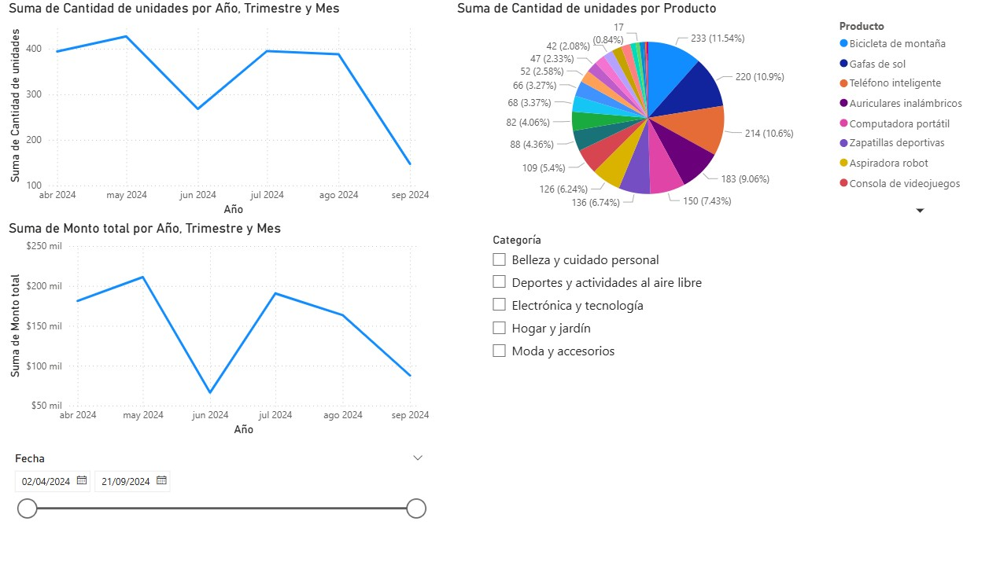

# Dashboard de Análisis Comercial Multi-Categoría

## Descripción del Proyecto
Este dashboard interactivo de Power BI proporciona una visión integral del rendimiento comercial de una empresa retail con presencia en múltiples categorías (Electrónica, Belleza, Hogar, Deportes y Moda). 

El objetivo principal es transformar datos de transacciones en insights accionables, permitiendo a los interesados monitorear tanto el volumen de inventario desplazado (unidades) como la salud financiera (facturación) de forma simultánea.

## Vista Previa

## Características Técnicas
* **Visualizaciones Dinámicas:** Gráficos de líneas de doble eje temporal para comparación de tendencias.
* **Segmentación Avanzada:** Filtros por categoría de producto y segmentador de fechas tipo "Slicer" para análisis de periodos específicos.
* **Modelado de Datos:** Estructura optimizada para el cálculo de porcentajes de participación y sumatorias de facturación dinámica.
