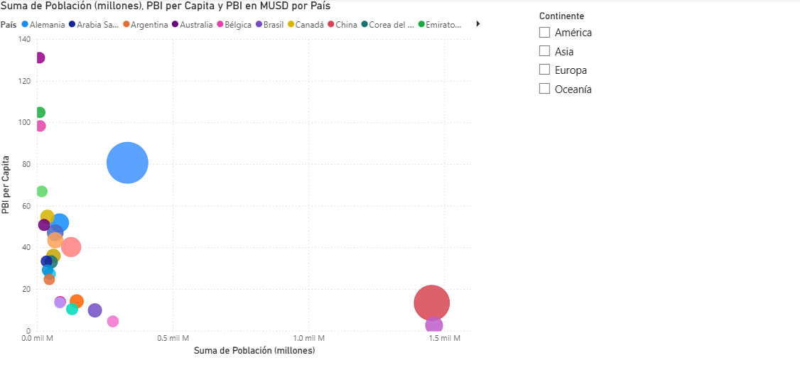

# Proyecto de Práctica – DAX y Visualización en Power BI

## Descripción
Este proyecto fue desarrollado únicamente con fines de práctica y aprendizaje del lenguaje DAX y la creación de visualizaciones en Power BI.

El objetivo principal fue trabajar cálculos básicos en DAX para analizar información económica y poblacional de distintos países mediante gráficos interactivos.

---

## Vista del Proyecto




---

## Tecnologías Utilizadas
- Microsoft Power BI
- DAX (Data Analysis Expressions)

---

## Funciones DAX Utilizadas

### PBI en MUSD

```DAX
PBI en MUSD =
SUMX(
    Paises,
    Paises[PBI (millones de moneda nacional)] /
    RELATED(Cambio[Tipo de cambio (USD/moneda nacional)])
)
```

### PBI per Capita

```DAX
PBI per Capita =
DIVIDE(
    Paises[PBI en MUSD],
    SUM(Paises[Población (millones)])
)
```

---

## Actividades Realizadas

Durante el desarrollo del proyecto se trabajó con:

- Creación de medidas en DAX.
- Uso de funciones SUMX.
- Uso de la función RELATED.
- Uso de la función DIVIDE.
- Relación entre tablas.
- Conversión de moneda utilizando tipo de cambio.
- Cálculo de PBI per cápita.
- Análisis y visualización de datos.

---

## Visualización Implementada

Se desarrolló un gráfico de dispersión para analizar:

- Relación entre población y PBI.
- Comparación entre países.
- Variación del PBI per cápita.
- Distribución de datos económicos según continente.

Además, se implementaron filtros por continente para facilitar el análisis interactivo.

---

## Objetivo del Proyecto

Fortalecer conocimientos básicos en DAX y mejorar habilidades en análisis de datos y visualización utilizando Power BI.

---

## Nota

Este proyecto fue realizado únicamente como práctica académica y de aprendizaje, por lo que no corresponde a un entorno productivo o empresarial real.
