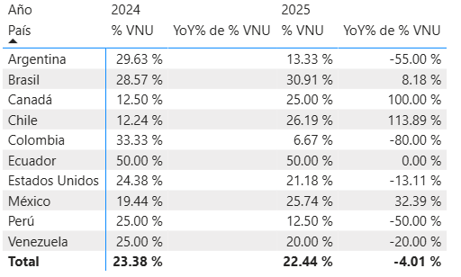
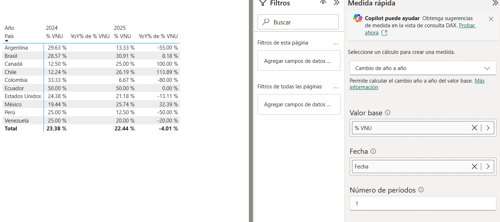

# Proyecto de Práctica – Medidas DAX y Análisis Año contra Año en Power BI

## Descripción
Este proyecto fue desarrollado únicamente con fines de práctica y aprendizaje del lenguaje DAX y análisis de datos en Power BI.

El objetivo principal fue trabajar medidas personalizadas, medidas rápidas y comparaciones año contra año utilizando tablas y porcentajes dinámicos.

---

## Vista del Proyecto

### Tabla de Porcentajes por Año



### Configuración de Medida Rápida



---

## Tecnologías Utilizadas
- Microsoft Power BI
- DAX (Data Analysis Expressions)

---

## Medida DAX Utilizada

### % VNU

```DAX
% VNU = 
    VAR CantidadVentasMayor1 =
        CALCULATE(COUNTROWS(Ventas), Ventas[Cantidad]>1)
    VAR CantidadVentas =
        COUNTROWS(Ventas)
    RETURN DIVIDE(CantidadVentasMayor1, CantidadVentas)
```

---

## Actividades Realizadas

Durante el desarrollo del proyecto se trabajó con:

- Creación de medidas personalizadas en DAX.
- Uso de variables VAR.
- Uso de la función CALCULATE.
- Uso de COUNTROWS.
- Uso de DIVIDE.
- Implementación de medidas rápidas.
- Comparación de datos año contra año (YoY).
- Creación de tablas de porcentajes.
- Análisis de ventas por país y año.

---

## Visualización Implementada

Se desarrolló una tabla dinámica para analizar:

- Porcentaje de VNU por país.
- Comparación entre los años 2024 y 2025.
- Variación porcentual año contra año (YoY%).
- Cambios y tendencias en ventas según país.

Además, se utilizó una medida rápida de Power BI para calcular automáticamente el cambio de año a año.

---

## Objetivo del Proyecto

Fortalecer conocimientos en DAX mediante la creación de medidas, análisis porcentuales y comparaciones temporales utilizando herramientas de visualización en Power BI.

---

## Nota

Este proyecto fue realizado únicamente como práctica académica y de aprendizaje, por lo que no corresponde a un entorno productivo o empresarial real.
