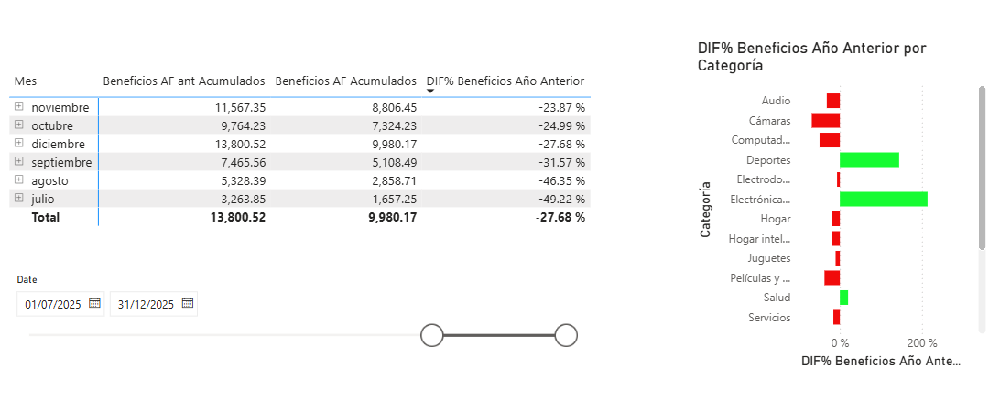

# Proyecto de Práctica – DAX e Inteligencia de Tiempo en Power BI

## Descripción
Este proyecto fue desarrollado únicamente con fines de práctica y aprendizaje de DAX e inteligencia de tiempo en Power BI.

El objetivo principal fue analizar beneficios acumulados, comparaciones contra el año anterior y variaciones porcentuales mediante medidas DAX y visualizaciones interactivas.

---

## Vista del Proyecto




---

## Medidas DAX Utilizadas

### Beneficios AF Acumulados

```DAX
Beneficios AF Acumulados =
TOTALYTD(
    [Beneficios Año Actual],
    Calendario[Date],
    "30-06"
)
```

### Beneficios AF ant Acumulados

```DAX
Beneficios AF ant Acumulados =
TOTALYTD(
    [Beneficios Año Anterior],
    Calendario[Date],
    "30-06"
)
```

### Beneficios Año Actual

```DAX
Beneficios Año Actual =
    VAR vPrecio =
        SUMX(
            Ventas,
            Ventas[Cantidad] *
            RELATED(Listado_Precios_Costos[Precio])
        )
    VAR vCosto =
        SUMX(
            Ventas,
            Ventas[Cantidad] *
            RELATED(Listado_Precios_Costos[Costo])
        )
    RETURN vPrecio - vCosto
```

### Beneficios Año Anterior

```DAX
Beneficios Año Anterior =
CALCULATE(
    [Beneficios Año Actual],
    DATEADD(Calendario[Date], -1, YEAR)
)
```

### DIF% Beneficios Año Anterior

```DAX
DIF% Beneficios Año Anterior =
DIVIDE(
    [Beneficios AF Acumulados] -
    [Beneficios AF ant Acumulados],
    [Beneficios AF ant Acumulados]
)
```

---


## Objetivo del Proyecto

Fortalecer conocimientos en DAX e inteligencia de tiempo utilizando Power BI para el análisis financiero y comparaciones temporales mediante visualizaciones dinámicas.

---

## Nota

Este proyecto fue realizado únicamente como práctica académica y de aprendizaje, por lo que no corresponde a un entorno productivo o empresarial real.
