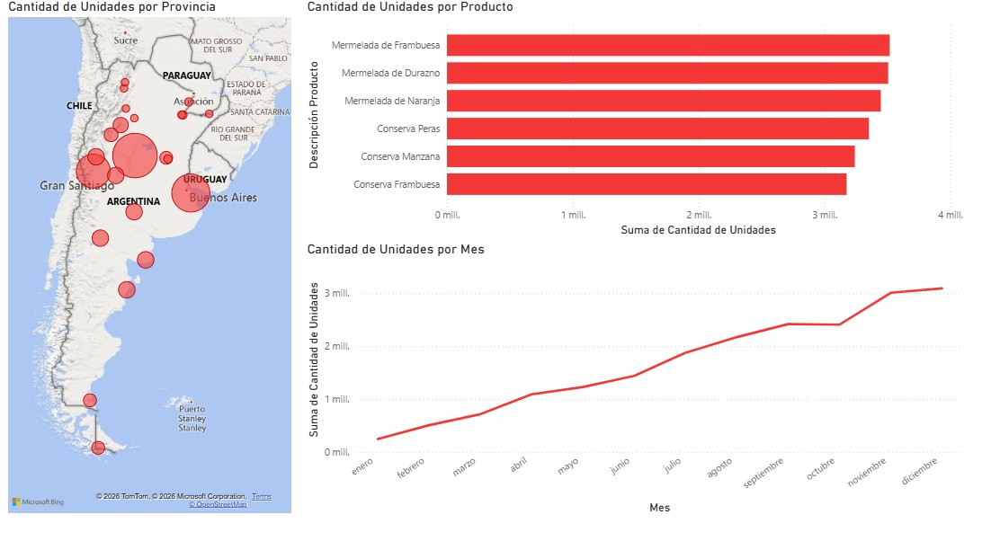

# Dashboard de Análisis de Distribución Regional: Alimentos y Conservas

## Descripción del Proyecto
Este dashboard interactivo de Power BI está diseñado para el monitoreo de la cadena de suministro y ventas regionales de una empresa de alimentos. El enfoque principal es la visualización geoespacial de la demanda en Argentina y países limítrofes, permitiendo identificar clústeres de consumo y el rendimiento de la línea de productos de conservas.

El objetivo es optimizar la toma de decisiones logística mediante el análisis de volumen de unidades por provincia y la estacionalidad de las ventas a lo largo del año fiscal.

## Vista Previa

##  Características Técnicas
* **Inteligencia Geoespacial:** Uso de mapas dinámicos para la segmentación de datos por provincias y regiones.
* **Análisis de Series Temporales:** Gráficos de tendencias lineales para evaluar el crecimiento acumulado mensual.
* **Visualización de Ranking:** Gráficos de barras horizontales optimizados para la comparación rápida de SKU (Stock Keeping Units).
* **Modelado de Datos:** Procesamiento de grandes volúmenes de unidades (millones) con limpieza de datos para nombres de provincias y categorías.
