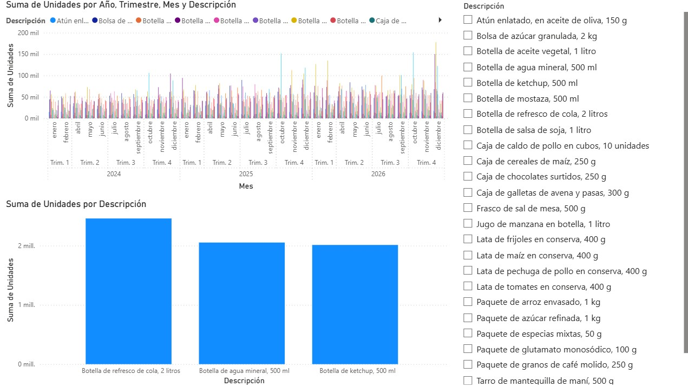
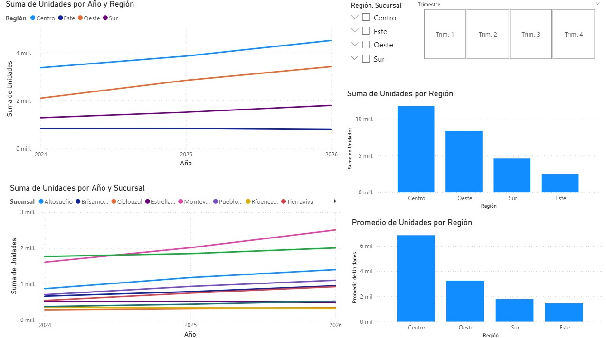

# Dashboard de Análisis de Ventas Retail: Sucursales y Canales de Consumo

## Descripción del Proyecto
Este proyecto presenta una solución analítica avanzada para el monitoreo de ventas de productos de consumo masivo (FMCG) a gran escala. El dashboard permite desglosar el rendimiento operativo desde una perspectiva macro (Regiones y Sucursales) hasta un nivel de detalle micro (SKU específico por descripción).

El objetivo principal es identificar patrones de crecimiento interanual durante el periodo **2024-2026**, facilitando la optimización del abastecimiento y la estrategia comercial según la zona geográfica y el comportamiento del consumidor.

## Vista Previa

## Características Técnicas
* **Jerarquía Temporal:** Visualizaciones configuradas para navegar desde Año y Trimestre hasta el detalle mensual.
* **Segmentación Avanzada:** Filtros dinámicos para una amplia gama de categorías (Líquidos, Conservas, Abarrotes).
* **Modelado Multivariable:** Gráficos de líneas de tendencia que permiten comparar múltiples sucursales y regiones de forma simultánea.
* **Análisis de Mix de Ventas:** Gráficos de barras optimizados para el ranking de productos más vendidos (Top SKUs).
