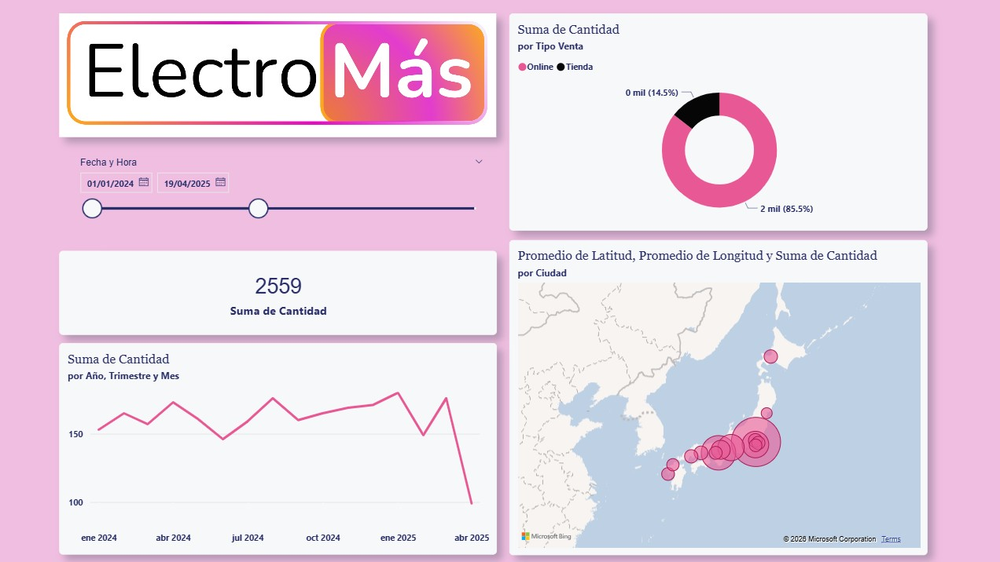
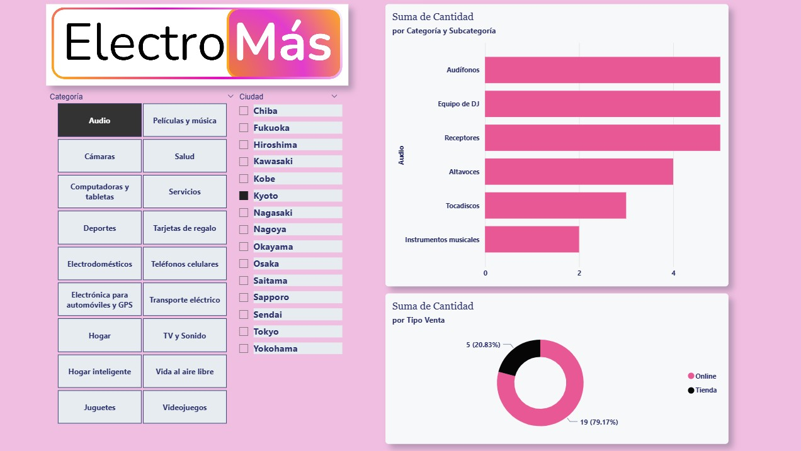

# Dashboard de Análisis Comercial: ElectroMás (Market Insights)

## Descripción del Proyecto
Este dashboard interactivo representa el análisis de rendimiento de "ElectroMás", una marca especializada en tecnología y electrónica de consumo. El proyecto se enfoca en la distribución de ventas en el mercado japonés, analizando el comportamiento de los consumidores tanto en canales digitales (Online) como físicos (Tienda).

El objetivo es proporcionar una herramienta visual para identificar las categorías de productos más rentables y entender la penetración geográfica de la marca en las principales ciudades de Japón.

## Vista Previa

## Características Técnicas
* **Interfaz de Usuario (UI):** Diseño moderno con una paleta de colores coherente y botones de navegación para categorías (Audio, Cámaras, Videojuegos, etc.).
* **Filtros Inteligentes:** Segmentación multiactiva por Ciudad (Kyoto, Osaka, Tokyo, etc.) y subcategorías de producto.
* **KPIs Dinámicos:** Tarjetas de resumen que muestran la **Suma Total de Cantidad** (2,559 unidades) de forma instantánea.
* **Visualización de Donas:** Gráficos circulares optimizados para entender la proporción de los canales de distribución.
