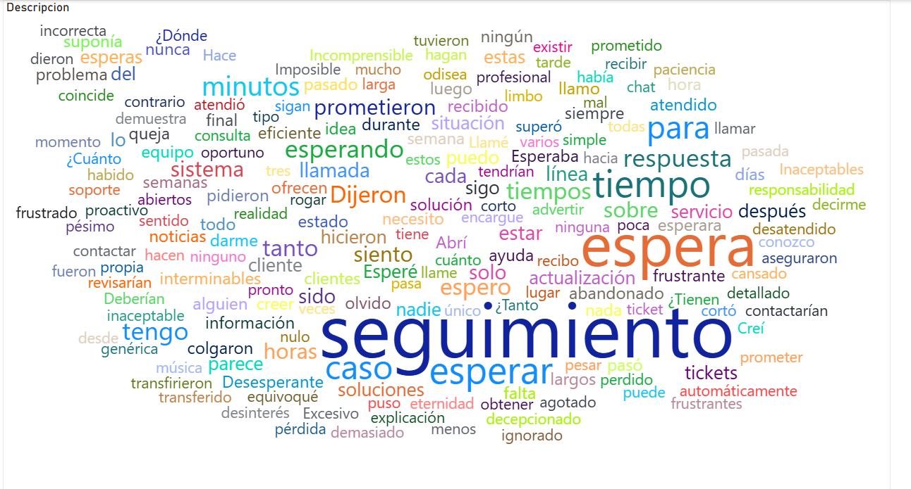
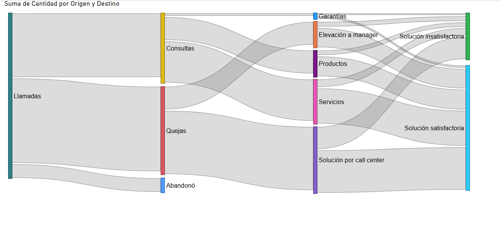
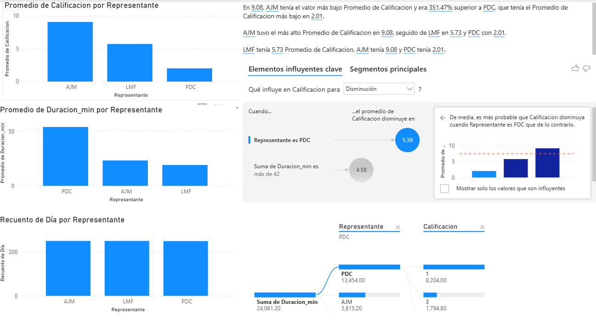

# Dashboard de Análisis de Customer Experience: Call Center Solutions

## Descripción del Proyecto
Este dashboard interactivo proporciona una visión de 360 grados sobre la operación de atención al cliente y la experiencia del usuario (CX). El proyecto integra el análisis de sentimientos cualitativo con métricas operativas cuantitativas, permitiendo identificar fallas en el proceso de seguimiento y optimizar el rendimiento del equipo de soporte.

El objetivo es reducir los tiempos de espera y mejorar la resolución en el primer contacto mediante la identificación de "puntos de dolor" expresados directamente por los clientes.

## Vista Previa

## Características Técnicas
* **Análisis de Influenciadores Clave:** Uso de Inteligencia Artificial para determinar qué variables (como el representante o el tiempo de duración) tienen mayor impacto en la disminución de la calificación del servicio.
* **Navegación Personalizada:** Sistema de pestañas integrado (Nube de Palabras, Sankey, Performance) para una experiencia de usuario fluida.
* **Visualizaciones de Flujo Avanzadas:** Implementación de diagramas Sankey para comprender la tasa de abandono y efectividad de resolución por canal.
* **KPIs de Calidad:** Cálculo dinámico del promedio de calificación (CSAT) segmentado por agente y tiempo de gestión.

