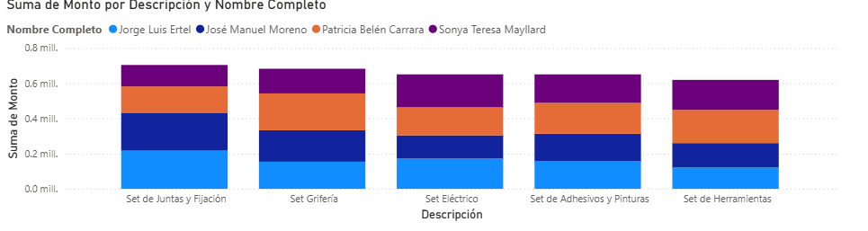

# Dashboard de Gestión de Ventas: Análisis de Insumos y Rendimiento Comercial

## 📝 Descripción del Proyecto
Este dashboard de Power BI proporciona un análisis detallado del rendimiento de ventas basado en la **Suma de Monto**. El reporte permite desglosar los ingresos por tipo de producto y evaluar el desempeño individual de la fuerza de ventas. 

El panel está diseñado para transformar datos crudos de múltiples fuentes en información accionable, permitiendo identificar qué categorías (como Grifería o Herramientas) tienen mayor peso financiero y qué asesores lideran dichas categorías.

## 🖼️ Vista Previa del Análisis

*Gráfico de columnas apiladas mostrando la distribución de montos por categoría y vendedor.*

## 📂 Orígenes de Datos e Integración
Este proyecto destaca por su arquitectura de datos híbrida, utilizando tres métodos principales de obtención en Power BI:

1.  **Google Sheets**
2.  **Carpeta Local**
3.  **Introducción Manual de Datos mediante la opción "Introducir datos"**

## 🚀 Características Técnicas
* **Conectividad Multi-fuente:** Integración fluida de datos locales y en la nube.
* **Visualizaciones Dinámicas:** Uso de gráficos de columnas apiladas para comparar el aporte de cada vendedor dentro de cada categoría de producto.
* **Segmentación Comercial:** Análisis específico para los asesores:
    * Jorge Luis Ertel
    * José Manuel Moreno
    * Patricia Belén Carrara
    * Sonya Teresa Mayllard

