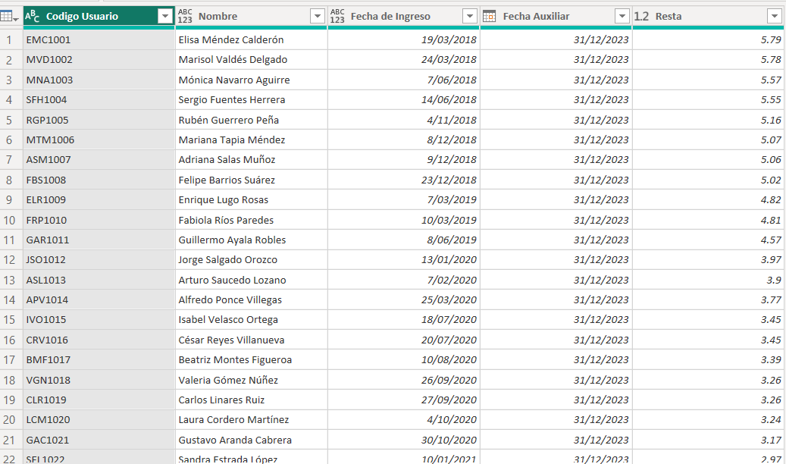

# Proyecto de Práctica Datos Empleados – Power Query en Power BI

## Descripción
Este proyecto fue desarrollado únicamente con fines de práctica y aprendizaje del uso de Power Query en Power BI.

El objetivo principal fue trabajar procesos de:

- Limpieza de datos.
- Transformación de información.
- Validación y calidad de datos.
- Preparación de datos para análisis.
- Manejo de tipos de datos y columnas calculadas.

## Vista del Proyecto

## Tecnologías Utilizadas
- Microsoft Power BI
- Power Query

## Actividades Realizadas
Durante el desarrollo del proyecto se practicaron tareas como:

- Cambio y validación de tipos de datos.
- Renombrado de columnas.
- Limpieza de registros inconsistentes.
- Formateo de fechas.
- Creación de columnas auxiliares y cálculos.
- Eliminación de valores nulos o duplicados.
- Transformación y organización de tablas.

## Objetivo del Proyecto
Fortalecer conocimientos en el uso de Power Query para procesos ETL (Extract, Transform, Load) y mejorar habilidades en preparación y calidad de datos dentro de Power BI.

## Nota
Este proyecto no fue desarrollado para producción ni para una empresa real; únicamente se realizó como práctica académica y de aprendizaje.
