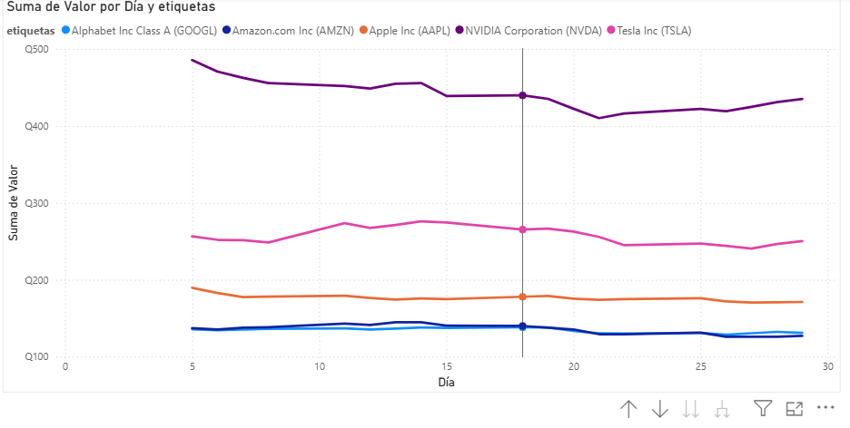
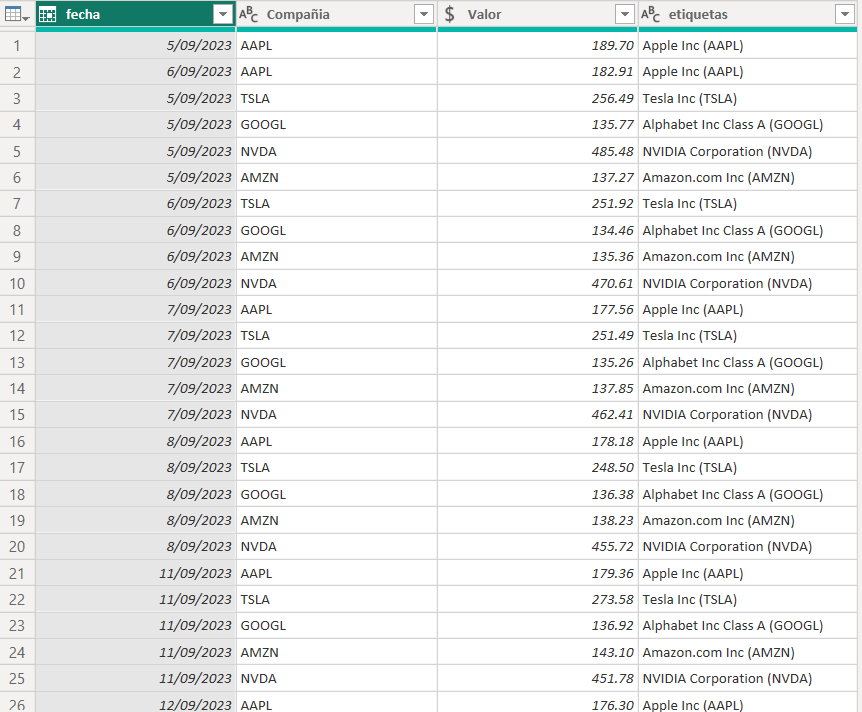

# Proyecto de Práctica – Power Query y Visualización en Power BI

## Descripción
Este proyecto fue desarrollado únicamente con fines de práctica y aprendizaje del uso de Power Query y visualización de datos en Power BI.

El objetivo principal fue practicar procesos de transformación, integración y preparación de datos para análisis visual.

---

## Vista del Proyecto

### Power Query – Transformación de Datos

### Visualización de Datos en Power BI

---

## Tecnologías Utilizadas
- Microsoft Power BI
- Power Query

---

## Actividades Realizadas

Durante el desarrollo del proyecto se trabajó con:

- Combinar consultas.
- Anexar consultas.
- Dinamización de columnas.
- Configuración regional aplicada a columnas.
- Combinación de columnas.
- Limpieza y transformación de datos.
- Validación de tipos de datos.
- Organización y preparación de información para análisis.

---

## Visualización Implementada

Se desarrolló un gráfico de líneas para analizar los valores según:

- Fechas.
- Empresas.
- Comportamiento y variación de datos.

Esto permitió visualizar tendencias y comparar información entre diferentes compañías.

---

## Objetivo del Proyecto

Fortalecer conocimientos en procesos ETL (Extract, Transform, Load) utilizando Power Query dentro de Power BI, además de practicar la creación de visualizaciones interactivas para análisis de datos.

---

## Nota

Este proyecto fue realizado únicamente como práctica académica y de aprendizaje, por lo que no corresponde a un entorno productivo o empresarial real.
